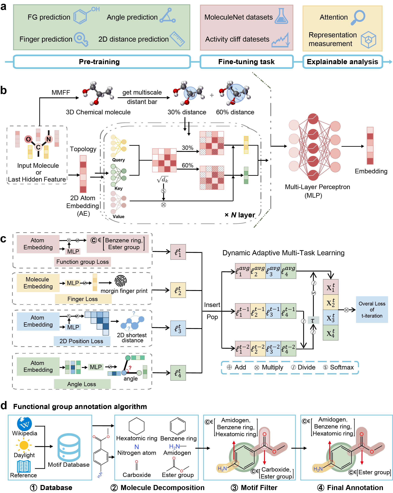

# SCAGE
[](https://example.com)  [](https://example.com)  [](https://example.com)

## Project Overview

The major challenges in the advance of drug development are frequent structure-activity cliffs and unknown drug properties that are expensive and time-consuming to estimate, causing a large number of failures and heavily unavoidable costs in the clinical phases. In this work, we propose  the self-conformation-aware Graph Transformer (SCAGE), an innovative deep learning architecture for molecular property prediction that is pre-trained with the conformation knowledge from 5~ million drug-like compounds, adaptively learning the generalized representations for a diversity of downstream tasks. Notably, we introduce a multi-task pretraining framework, termed M4, which includes four supervised and unsupervised tasks, covering from molecular structures to functions. This approach enables us to learn comprehensive conformation-aware prior knowledge, thereby boost the generalization of SCAGE on a variety of molecular property tasks. Moreover, we design a data-driven Multi-scale Conformational Learning module that effectively and directly guide the model in understanding and representing atomic relationships from molecular conformation scale, eliminating the manually designed inductive biases in existing methods. We show that SCAGE achieves significant performance improvements on 9 molecular property and 30 structure-activity cliff benchmarks. Case studies demonstrate that SCAGE accurately capture crucial functional groups at atomic level that are closely associated with the molecular activity, providing valuable insights in uncovering quantitative structure-activity relationships (QSAR). Overall, we anticipate that SCAGE offers a novel and reliable perspective for revealing the rules of structure-activity relationships, thereby accelerating progress in drug discovery.



## Installation

### 1. Cloning the Project

First, you need to clone the project repository from GitHub to your local machine. You can do this by running the following command in your terminal:

```bash
git clone https://github.com/KazeDog/scage.git
```

This command will create a copy of the   project in your current working directory.

### 2. Setting Up the Environment

After cloning the project, the next step is to set up the project environment. This project uses Conda, a popular package and environment management system. To create the environment with all the required dependencies, navigate to the project directory and run:

```bash
cd scage
conda env create -f environment.yml
```

This command will read the environment.yml file and create a new Conda environment with the name specified in the file. It will also install all the dependencies listed in the file.
For installing the algos, you should use
```bash
python setup.py build_ext --inplace
``` 


### 3. Activating the Environment

Once the environment is created, you need to activate it. To do so, use the following command:

```bash
conda activate scage
```

Replace **scage** with the actual name of the environment, as specified in the **environment.yml** file.


## Pretraining


### 1. preparing dataset

You can find the toy pretrain dataset in ``./data/pretrain``. 
Preprocess dataset:


```bash
python prepare_data.py --taskname pretrain --dataroot ./data/pretrain/pretrain1000.txt --datatarget ./data/pretrain/pretrain_data.pkl
```
Then you can get the processed pretrain dataset. Also, we have stored all the data we used in ``./data``.

### Note

-  You can find the toy dataset in ``./data/pretrain``.

### 2. Pretraining
Usage:
```bash
usage: pretrain.py [-h] [--dataroot DATAROOT] [--epochs EPOCHS] [--seed SEED] [--batch_size BATCH_SIZE] [--lr LR] [--weight_decay WEIGHT_DECAY] [--dataloader_num_workers DATALOADER_NUM_WORKERS]
                   [--emdedding_dim EMDEDDING_DIM] [--hidden_dim HIDDEN_DIM] [--layer_num LAYER_NUM] [--num_heads NUM_HEADS] [--dist_bar DIST_BAR [DIST_BAR ...]]
                   [--pretrain_task PRETRAIN_TASK [PRETRAIN_TASK ...]] [--gpus GPUS]

parameters of pretraining SCAGE

options:
  -h, --help            show this help message and exit
  --dataroot DATAROOT   data root
  --epochs EPOCHS       number of total epochs to run (default: 100)
  --seed SEED           seed (default: 8)
  --batch_size BATCH_SIZE
                        batch size (default: 40)
  --lr LR               learning rate (default: 0.00005)
  --weight_decay WEIGHT_DECAY
                        weight decay of the optimizer (default: 0.0001)
  --dataloader_num_workers DATALOADER_NUM_WORKERS
                        number of processes loading the dataset (default: 24)
  --emdedding_dim EMDEDDING_DIM
                        embedding dimensions for atomic features (default: 512)
  --hidden_dim HIDDEN_DIM
                        hidden layer dimension in transformer (default: 256)
  --layer_num LAYER_NUM
                        number of transformer layers (default: 6)
  --num_heads NUM_HEADS
                        for controlling long attention spans (default: 16)
  --dist_bar DIST_BAR [DIST_BAR ...]
                        selecting distance bars
  --pretrain_task PRETRAIN_TASK [PRETRAIN_TASK ...]
                        selecting pretraining tasks
  --gpus GPUS           gpu ids
```
Commands for pretrain:
```bash
python pretrain.py --dataroot ./data/pretrain/pretrain_data.pkl \
--epochs 100 \
--seed 8 \
--batch_size 40 \
--lr 0.00005 \
--weight_decay 0.0001 \
--dataloader_num_workers 24 \
--emdedding_dim 512 \
--hidden_dim 256 \
--layer_num 6 \
--num_heads 16 --gpus 0
```
## Finetuning

### 1. finetune with pre-trained SCAGE

Pre-trained SCAGE has been placed in ``./weights/pretrain``. 
You can find the processed molecular property prediction dataset and its scaffold split at ``./data/mpp``.
Here we store the BBBP for testing purposes and you can download the total dataset [here](https://drive.google.com/file/d/11w5gG3wpER595AhroFRgGlBFD78njCzc/view?usp=drive_link).

### 2. Finetuning
You can then use ``finetune_mpp.py`` to fine-tune on the Molecular Properties Prediction dataset or ``finetune_cliff.py`` on the Activity Cliff dataset.
Take ``finetune_mpp.py`` as an example.
Usage:
```bash
usage: finetune_mpp.py [-h] [--task TASK] [--dataroot DATAROOT] [--splitroot SPLITROOT] [--epochs EPOCHS] [--seed SEED] [--batch_size BATCH_SIZE] [--lr LR] [--weight_decay WEIGHT_DECAY] [--dropout DROPOUT]
                       [--dataloader_num_workers DATALOADER_NUM_WORKERS] [--emdedding_dim EMDEDDING_DIM] [--hidden_dim HIDDEN_DIM] [--layer_num LAYER_NUM] [--num_heads NUM_HEADS]
                       [--optim_type {adam,rms,sgd}] [--patience PATIENCE] [--dist_bar DIST_BAR [DIST_BAR ...]] [--gpus GPUS] [--ckpt CKPT]

parameters of finetuning SCAGE

options:
  -h, --help            show this help message and exit
  --task TASK           task name (default: bbbp)
  --dataroot DATAROOT   data root
  --splitroot SPLITROOT
                        split root
  --epochs EPOCHS       number of total epochs to run (default: 100)
  --seed SEED           seed (default: 13)
  --batch_size BATCH_SIZE
                        batch size (default: 32)
  --lr LR               learning rate (default: 0.00005)
  --weight_decay WEIGHT_DECAY
                        weight decay of the optimizer (default: 0.0001)
  --dropout DROPOUT     dropout rate (default: 0.1)
  --dataloader_num_workers DATALOADER_NUM_WORKERS
                        number of processes loading the dataset (default: 4)
  --emdedding_dim EMDEDDING_DIM
                        embedding dimensions for atomic features (default: 512)
  --hidden_dim HIDDEN_DIM
                        hidden layer dimension in transformer (default: 256)
  --layer_num LAYER_NUM
                        number of transformer layers (default: 6)
  --num_heads NUM_HEADS
                        for controlling long attention spans (default: 16)
  --optim_type {adam,rms,sgd}
                        optimizer type (default: adam)
  --patience PATIENCE   patience for early stopping (default: 10)
  --dist_bar DIST_BAR [DIST_BAR ...]
                        selecting distance bars
  --gpus GPUS           gpu ids
  --ckpt CKPT           checkpoint path
```
Commands for pretrain:
```bash
python finetune_mpp.py --task bbbp \
--dataroot ./data/mpp/pkl \
--splitroot ./data/mpp/split/
```
And you can also use the following command to finetune on the Activity Cliff dataset.
```bash
usage: finetune_cliff.py [-h] [--task TASK] [--dataroot DATAROOT] [--cliff_closs] [--epochs EPOCHS] [--seed SEED] [--batch_size BATCH_SIZE] [--lr LR] [--weight_decay WEIGHT_DECAY] [--dropout DROPOUT]
                         [--dataloader_num_workers DATALOADER_NUM_WORKERS] [--emdedding_dim EMDEDDING_DIM] [--hidden_dim HIDDEN_DIM] [--layer_num LAYER_NUM] [--num_heads NUM_HEADS]
                         [--optim_type {adam,rms,sgd}] [--dist_bar DIST_BAR [DIST_BAR ...]] [--gpus GPUS] [--ckpt CKPT]

parameters of finetuning SCAGE on Activity cliffs datasets

options:
  -h, --help            show this help message and exit
  --task TASK           task name (default: CHEMBL1862_Ki)
  --dataroot DATAROOT   data root
  --cliff_closs         add active cliff classification tasks
  --epochs EPOCHS       number of total epochs to run (default: 100)
  --seed SEED           seed (default: 8)
  --batch_size BATCH_SIZE
                        batch size (default: 64)
  --lr LR               learning rate (default: 0.0005)
  --weight_decay WEIGHT_DECAY
                        weight decay of the optimizer (default: 0.0001)
  --dropout DROPOUT     dropout rate (default: 0.1)
  --dataloader_num_workers DATALOADER_NUM_WORKERS
                        number of processes loading the dataset (default: 4)
  --emdedding_dim EMDEDDING_DIM
                        embedding dimensions for atomic features (default: 512)
  --hidden_dim HIDDEN_DIM
                        hidden layer dimension in transformer (default: 256)
  --layer_num LAYER_NUM
                        number of transformer layers (default: 6)
  --num_heads NUM_HEADS
                        for controlling long attention spans (default: 16)
  --optim_type {adam,rms,sgd}
                        optimizer type (default: adam)
  --dist_bar DIST_BAR [DIST_BAR ...]
                        selecting distance bars
  --gpus GPUS           gpu ids
  --ckpt CKPT           checkpoint path
```

For the Activity Cliff dataset, you can use the following command:
```bash
python finetune_cliff.py --task CHEMBL1862_Ki \
--dataroot ./data/cliff/cliff_pkl \
```


## Evaluation
To ensure the reproducibility of SCAGE, we provided finetuned models for 9 MPP datasets, including:
- [BACE](https://drive.google.com/file/d/1th00Tj5KfxVjkZbxNlybJAsu9KhQNlDt/view?usp=drive_link)
- [BBBP](https://drive.google.com/file/d/1LDFMuL6vQC7OMK_tBbrs4k-PkoU_JSF5/view?usp=drive_link)
- [ClinTox](https://drive.google.com/file/d/1w4e0egF8qkq4GjXRvh5sNZvW032u5dDp/view?usp=drive_link)
- [Tox21](https://drive.google.com/file/d/13WDSy64yfAPXu7NNPFmsv0pB2yheBZKX/view?usp=drive_link)
- [ToxCast](https://drive.google.com/file/d/1CWtBprHT5FMdUaFVuk7hMbqFlpItOtW4/view?usp=drive_link)
- [SIDER](https://drive.google.com/file/d/1kAx3llo5-QryN_aqO9073YvUHMYJ_I6f/view?usp=drive_link)
- [ESOL](https://drive.google.com/file/d/1H4vZ1trjlQ9Djk8_MHvlxbLDDWlvCXKI/view?usp=drive_link)
- [FreeSolv](https://drive.google.com/file/d/1QJxn34BQDwJkIUIlwm1lJ2518zVbzOPU/view?usp=drive_link)
- [Lipophilicity](https://drive.google.com/file/d/1iGhIvI5o1QCdWUbGHk5qhgLGr2uQkzae/view?usp=drive_link)

We also provide finetuned models for the 30 [active cliff datasets](https://drive.google.com/file/d/1-i_HhCE2OjALzJFEn7lGU6hFzajQNh0s/view?usp=drive_link).<br>
You can download these models and place them in the corresponding directory under ``.weights/``.

You can evaluate the finetuned model by using the following command:
```bash
usage: evaluate_mpp.py [-h] [--task TASK] [--dataroot DATAROOT] [--splitroot SPLITROOT] [--batch_size BATCH_SIZE] [--dataloader_num_workers DATALOADER_NUM_WORKERS] [--gpus GPUS]

Evaluation of SCAGE

options:
  -h, --help            show this help message and exit
  --task TASK           task name (default: bbbp)
  --dataroot DATAROOT   data root
  --splitroot SPLITROOT
                        split root
  --batch_size BATCH_SIZE
                        batch size (default: 32)
  --dataloader_num_workers DATALOADER_NUM_WORKERS
                        number of processes loading the dataset (default: 4)
  --gpus GPUS           gpu ids
 ```
For example:
```bash
python evaluate_mpp.py --task bbbp \
--dataroot ./data/mpp/pkl \
--splitroot ./data/mpp/split/
```

## Training details
During the pretraining phase, our model requires approximately 30 hours to train on two Tesla A100 GPUs, 
with a batch size of 16, 6 model layers, and a hidden layer dimensionality of 512. 

The finetuning time depends on the dataset; an example training log is provided in the ``./log.txt`` file.

## License

This project is licensed under the MIT License - see the [LICENSE](LICENSE) file for details.